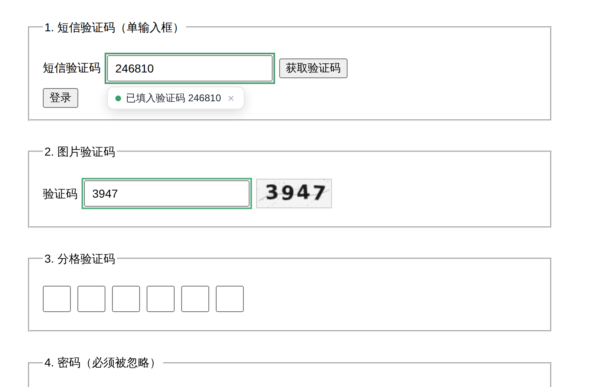
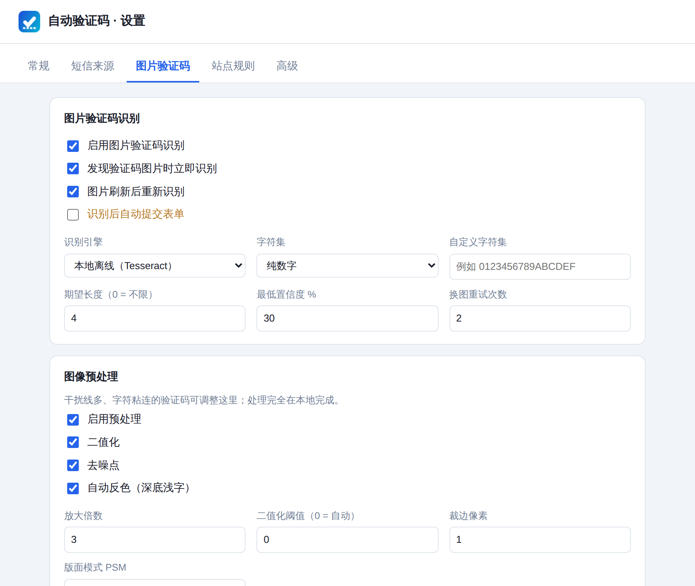
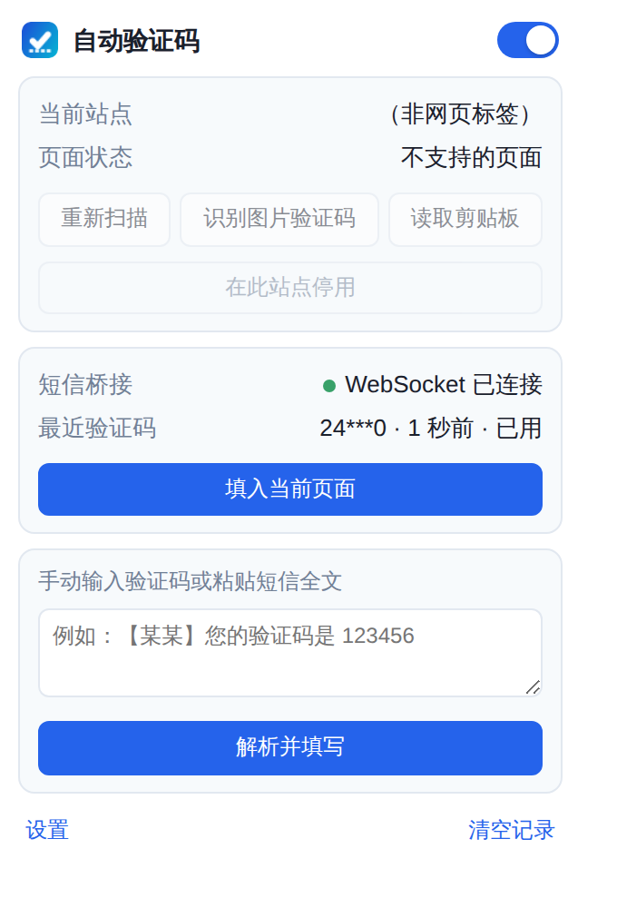

<h1 align="center">Auto Verification Code</h1>

<p align="center">
  自动接收短信验证码并填写，本地离线识别图片验证码的 Microsoft Edge / Chromium 扩展。
</p>

<p align="center">
  <a href="https://github.com/Cqusts/Auto-verification-code/actions/workflows/ci.yml"></a>
  <a href="LICENSE"></a>
  
  
  
</p>

<p align="center">
  
</p>

---

## 这是什么

登录时那两件烦人的事 —— 切到手机抄验证码、眯着眼辨认图片里的四个字符 —— 交给浏览器自动完成。

- **短信验证码**：验证码到手机后自动出现在网页输入框里
- **图片验证码**：自动截取验证码图片、本地识别、填入

识别全程在你自己的机器上完成。图片不上传，验证码不落盘，不经过任何第三方服务。

## 功能

| | |
| --- | --- |
| **短信验证码自动填写** | 从你自己运行的本地桥接服务接收短信，打分式解析出验证码后填入页面 |
| **图片验证码识别** | 内置 Tesseract WASM 离线 OCR，自动预处理（二值化、去噪、放大）后识别；可切换到本地 ddddocr 应对扭曲/干扰线验证码 |
| **智能字段识别** | 区分「短信验证码框」与「图片验证码框」，支持分格输入框、Shadow DOM、iframe |
| **多种短信来源** | WebSocket 推送 / HTTP 轮询 / 剪贴板 / 手动粘贴 |
| **一键启动** | 双击启动脚本，或生成桌面快捷方式；脚本自动定位项目路径 |
| **站点规则** | 全局黑名单，或只在白名单站点生效 |
| **安全默认值** | 自动提交默认关闭；验证码只存在内存中，浏览器关闭即清除 |

## 安装

尚未上架扩展商店，以开发者模式加载。两种拿到文件的方式：

**方式一：下载发布包**（只想用扩展）

到 [Releases](https://github.com/Cqusts/Auto-verification-code/releases) 下载最新的 `auto-verification-code-*.zip` 并解压。

**方式二：克隆仓库**（还想用短信功能，桥接服务在仓库里）

```bash
git clone https://github.com/Cqusts/Auto-verification-code.git
cd Auto-verification-code
```

然后无论哪种方式：

1. 打开 Edge，地址栏输入 `edge://extensions/`
2. 打开左下角 **开发人员模式**
3. 点击 **加载解压缩的扩展**，选择 `extension/` 目录（发布包解压后就是这个目录）

装好即可用，**不需要 `npm install`** —— 项目零运行时依赖，离线 OCR 资源已随包提供。安装后已经打开的标签页会被自动注入，不必逐个刷新。

> 加载后**不要移动或删除这个目录** —— 开发者模式记的是绝对路径，移动后浏览器下次启动就找不到它了。
>
> Chrome / Chromium 同样适用：`chrome://extensions/` → 开发者模式 → 加载已解压的扩展程序。
> 自己打包：`npm run build`，产物在 `dist/`。

## 快速开始

### 图片验证码 —— 零配置

打开带图片验证码的登录页即可。扩展会自动找到验证码图片、识别并填入。

想调参或看识别效果，去 **设置 → 图片验证码 → 识别测试**，拖入一张验证码图片，会并排显示预处理前后的图和识别结果。

<p align="center">
  
</p>

### 短信验证码 —— 需要一个本地桥接

浏览器读不到手机短信，所以需要一条「手机 → 电脑 → 浏览器」的通路。仓库自带零依赖的参考实现：

```bash
npm run bridge
```

终端会打印令牌和三行配置：

```
WebSocket URL  ws://127.0.0.1:8787/ws
HTTP URL       http://127.0.0.1:8787/latest
token          xxxxxxxxxxxx
```

填进 **扩展设置 → 短信来源 → WebSocket 推送**，点「测试连接」确认成功。

不接手机也能先验证整条链路：

```bash
curl -X POST "http://127.0.0.1:8787/sms?token=你的令牌" \
     -H 'Content-Type: application/json' \
     -d '{"text":"【测试】您的验证码是 123456，5分钟内有效"}'
```

页面上的验证码输入框应当立刻被填上 `123456`。

然后让手机把验证码短信转发过来 —— Android 用「短信转发器」类 App，iOS 用系统自带的「快捷指令」自动化，两者的完整步骤见 [docs/SMS-SETUP.md](docs/SMS-SETUP.md)。

日常使用不必记命令 —— 直接双击项目根目录下的启动脚本即可：

| 系统 | 双击这个 |
| --- | --- |
| Windows | `start-bridge.cmd` |
| macOS / Linux | `start-bridge.sh` |

脚本会自己定位项目路径（按脚本自身位置，不是当前工作目录），所以整个仓库换个地方放也不用改任何配置。窗口开着就是服务在跑，关掉窗口即停止；出错时窗口会停住，不会一闪而过。

**连进项目目录都懒得进**：双击一次 `create-shortcut.cmd`（macOS / Linux 用 `npm run shortcut`），桌面上就会多一个带图标的启动入口，以后直接点桌面图标即可。

```bash
npm run shortcut          # 在桌面创建
npm run shortcut:remove   # 移除
```

> 桌面快捷方式里存的是绝对路径，项目文件夹换了位置就重新生成一次。
>
> 令牌只在第一次运行时生成并持久化保存，之后每次启动都是同一个，扩展里填一次就够了。

<p align="center">
  
</p>

## 文档

| 文档 | 内容 |
| --- | --- |
| [SMS-SETUP.md](docs/SMS-SETUP.md) | 把短信送进浏览器的四种方式（Android / iOS / 剪贴板 / 自建接口） |
| [OCR.md](docs/OCR.md) | 识别率调优对照表，接入自建 ddddocr / PaddleOCR |
| [ARCHITECTURE.md](docs/ARCHITECTURE.md) | 代码结构、数据流与关键设计取舍 |
| [bridge/README.md](bridge/README.md) | 桥接服务的接口说明 |
| [CHANGELOG.md](CHANGELOG.md) | 版本更新日志 |

## 隐私与安全

- **验证码不落盘。** 收到的验证码只写入 `chrome.storage.session`（纯内存），浏览器关闭即消失；界面上只显示打码后的形式。
- **识别全程离线。** 默认使用扩展内置的 Tesseract WASM，验证码图片不会离开本机。只有当你主动配置「自建 HTTP 接口」时，图片才会发往你自己指定的地址。
- **网络只连你配置的地址。** 扩展不会向作者或任何第三方发送数据。
- **自动提交默认关闭。** 填写是可撤销的，提交不是。确认识别稳定后再考虑开启。
- **建议把网银、支付等敏感站点加入设置里的黑名单。**

扩展申请 `<all_urls>` 主机权限，是因为验证码可能出现在任何站点，且跨域验证码图片需要读取像素。若只在少数站点使用，请在 **设置 → 站点规则** 中切换到「仅白名单站点」。

## 已知限制

- 内置 OCR 擅长「较清晰的数字 / 英文字母」验证码。**滑块、点选文字、图片旋转、算术题、reCAPTCHA、hCaptcha 等交互式验证不在支持范围内**，扩展会直接忽略。
- 干扰严重、字符粘连的验证码识别率有限，可调整预处理参数，或改接自建 OCR 服务，见 [docs/OCR.md](docs/OCR.md)。
- 短信通路依赖你自己的转发方案；扩展本身不能读取手机短信，这是浏览器沙箱的硬限制。

## 排错

**「填写失败：Could not establish connection. Receiving end does not exist.」**
浏览器在说「这个标签页里没有内容脚本」。扩展在安装、更新和启动时会自动注入所有已打开的标签页，弹窗按钮失败时也会自动补注入，正常情况下不该看到它。若仍出现：该页面多半是浏览器内置页（`edge://`、扩展商店、PDF 阅读器），扩展无法在这类页面运行。刷新一次页面也一定能恢复。

**启动时报 `EADDRINUSE`。** 端口 8787 已被占用，多半是之前启动的那个窗口还开着 —— 直接用它就行。找不到窗口了就在任务管理器里结束 `node.exe`，或换个端口：`start-bridge.cmd --port 8788`（记得同步改扩展设置里的 WebSocket 地址）。

**iOS 快捷指令报 `kCFErrorDomainCFNetwork 错误 -1001`。** 请求超时 —— 自动化其实成功触发了，断的是网络。手机浏览器先打开 `http://电脑IP:8787/status`：能打开就是快捷指令配置问题，打不开就是 Windows 防火墙或不在同一 Wi-Fi。完整五步排查见 [docs/SMS-SETUP.md](docs/SMS-SETUP.md)。

**短信来了但没填。** 按顺序查：桥接终端有没有打印那条短信 → 打印里的 `N client(s)` 是不是 0（0 表示扩展没连上，去设置点「测试连接」）→ 弹窗「最近验证码」有没有出现（有则说明解析成功，是页面上没找到输入框）→ 设置里开启「输出调试日志」后在「高级 → 运行日志」看具体原因。

**验证码解析错了。** 在弹窗里把整条短信粘进去点「解析并填写」，能直接看出解析结果。取错数字就去 **设置 → 常规** 调「识别关键词」和长度范围。

**图片验证码识别不准。** 先用识别测试拖入图片，看「预处理后」那张 —— 人眼都费劲的话 OCR 一定不行，调参对照表见 [docs/OCR.md](docs/OCR.md)。

但如果验证码属于**整体扭曲、有贯穿干扰线、彩色噪点背景**这几类，调参是白费力气 —— 内置的 Tesseract 按印刷体训练，对这类图基本无解。换引擎：`pip install ddddocr flask`，然后双击 `start-ocr.cmd`，在设置里把识别引擎改成「自建 HTTP 接口」。ddddocr 正是拿这类国内验证码训练的。

## 开发

```bash
npm run check          # 静态检查：语法、JSON、manifest 引用、文档链接、依赖资源
npm test               # 上面 + 短信解析 / 桥接协议 / 网卡排序 / 桌面快捷方式 / 桥接服务
npm run test:browser   # 追加：真实 Chromium 加载扩展跑完整链路（较慢）
npm run build          # 打包 dist/*.zip
npm run bridge         # 启动桥接服务（等价于双击 start-bridge.*）
npm run shortcut       # 在桌面创建启动快捷方式
npm run vendor         # 重新下载离线 OCR 资源
npm run icons          # 重新生成扩展图标与 icon.ico
npm run screenshots    # 重新生成 README 里的截图
```

浏览器测试是真的：加载扩展 → 连接桥接 → 推送一条短信 → 断言输入框被填上 → 渲染一张带干扰线的验证码 → 断言被正确识别。需要 Playwright 的 Chromium。

### 项目结构

```
start-bridge.cmd      Windows 启动脚本（双击即用）
start-ocr.cmd         启动本地 ddddocr 识别服务（可选，应对难验证码）
start-bridge.sh       macOS / Linux 启动脚本
create-shortcut.cmd   在桌面创建启动快捷方式
extension/            扩展本体（Manifest V3，无构建步骤）
  src/common/         三个上下文共用：配置、短信解析、特征库
  src/background/     service worker：消息路由、验证码仓库、站点规则
  src/offscreen/      长连接与 OCR：桥接客户端、图像预处理、Tesseract
  src/content/        页面侧：字段识别、拟真填写、验证码取图
  src/popup|options/  界面
  vendor/tesseract/   离线 OCR 资源
bridge/               零依赖短信桥接服务（含手写 WebSocket 实现）
ocr-server/           可选的本地 ddddocr 识别服务（Python）
scripts/              取依赖、生成图标、检查、测试、打包、截图、快捷方式
test/fixtures/        浏览器端到端测试用的页面
docs/                 文档
```

设计取舍与数据流见 [docs/ARCHITECTURE.md](docs/ARCHITECTURE.md)。

## 贡献

欢迎 Issue 和 PR。提 PR 前请确保 `npm test` 通过；改动扩展本体时也请跑一遍 `npm run test:browser`。

发布新版本：更新 `package.json` 与 `extension/manifest.json` 的版本号、在 `CHANGELOG.md` 加一节（`npm run check` 会校验三者一致），然后推一个 `v*` 标签，GitHub Actions 会自动跑测试、打包并发布 Release。

新增站点适配尤其欢迎 —— 如果某个网站的验证码没被正确识别，请在 Issue 里附上该字段的 `name` / `id` / `placeholder` 和验证码图片的样子。

## License

[MIT](LICENSE)

内置 [Tesseract.js](https://github.com/naptha/tesseract.js)（Apache-2.0）与 [tessdata](https://github.com/tesseract-ocr/tessdata) 语言模型（Apache-2.0）。
